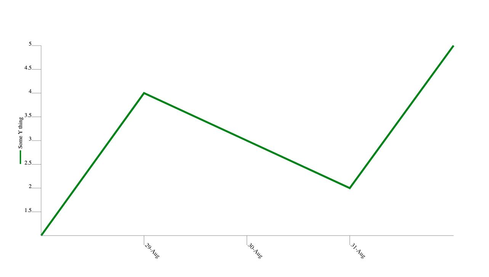

# Yew charting library

yew-chart is a collection of components that can be assembled to form charts
for the [Yew framework](https://github.com/yewstack/yew).

Here is a soil moisture/rainfall chart that has been produced using this library:


By leveraging these SVG-based components many types of charts can be formed
with a great deal of flexibility. The library is intended as a toolkit that
provides conveniences for rendering chart primitives. These primitives can
be regarded at a similar level as SVG's primitives i.e. lines, polygons etc.

Here is a very basic chart produced by the examples/basic project:



...and here's the essence of the Yew view method code that was used to generate it:

```rust
fn view(&self) -> yew::Html {
    html! {
        <svg class="chart" viewBox=format!("0 0 {} {}", WIDTH, HEIGHT) preserveAspectRatio="none">
            <HorizontalSeries
                series_type=horizontal_series::SeriesType::Line
                name="some-series"
                data=Rc::clone(&self.data_set)
                data_labels=Some(Rc::clone(&self.data_set_labels))
                horizontal_scale=self.time.start.timestamp() as f32..self.time.end.timestamp() as f32
                horizontal_scale_step=Duration::days(1).num_seconds() as f32
                vertical_scale=0.0..5.0
                x=MARGIN y=MARGIN width={WIDTH - (MARGIN * 2)} height={HEIGHT - (MARGIN * 2)} />

            <VerticalAxis
                name="some-y-axis"
                orientation=vertical_axis::Orientation::Left
                scale=0.0..5.0 scale_step=0.5
                x1=MARGIN y1=MARGIN y2={HEIGHT - MARGIN}
                tick_len=TICK_LENGTH
                title="Some Y thing".to_string() />

            <HorizontalTimeAxis
                time=self.time.to_owned() time_step=Duration::days(1)
                x1=MARGIN y1={HEIGHT - MARGIN} x2={WIDTH - MARGIN}
                tick_len=TICK_LENGTH />

        </svg>
    }
}
```

## Contribution policy

Contributions via GitHub pull requests are gladly accepted from their original author. Along with any pull requests, please state that the contribution is your original work and that you license the work to the project under the project's open source license. Whether or not you state this explicitly, by submitting any copyrighted material via pull request, email, or other means you agree to license the material under the project's open source license and warrant that you have the legal authority to do so.

## License

This code is open source software licensed under the [Apache-2.0 license](./LICENSE).

© Copyright [Titan Class P/L](https://www.titanclass.com.au/), 2021
