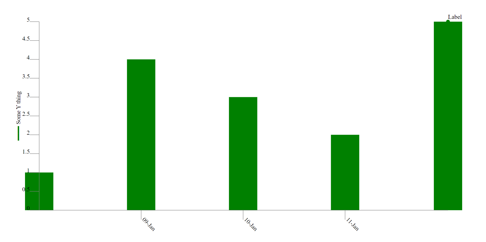

# Yew Charting Library

`yew-chart` is a collection of components that can be assembled to form charts
for the [Yew framework](https://github.com/yewstack/yew).

Here is a soil moisture/rainfall chart that has been produced using this library:

<p align="center"></p>

Here's another chart produced by this library, representing what is known as ["Delta-T"](http://www.bom.gov.au/lam/deltat.shtml):

<p align="center"></p>

By leveraging these SVG-based components many types of charts can be formed
with a great deal of flexibility. The library is intended as a toolkit that
provides conveniences for rendering chart primitives. These primitives can
be regarded at a similar level as SVG's primitives i.e. lines, polygons etc.

## Example Plots

Two basic projects are given in the `examples` folder.

### Line Chart

`examples/basic` is configured to output a basic line chart:

<p align="center"></p>

...and here's the essence of the Yew view method code that was used to generate it:

```rust
fn view(&self, _ctx: &Context<Self>) -> yew::Html {
    html! {
        <svg class="chart" viewBox={format!("0 0 {} {}", WIDTH, HEIGHT)} preserveAspectRatio="none">
            <HorizontalSeries
                series_type={horizontal_series::SeriesType::Line}
                name="some-series"
                data={Rc::clone(&self.data_set)}
                data_labels={Some(Rc::clone(&self.data_set_labels))}
                horizontal_scale={Rc::clone(&self.horizontal_axis_scale)}
                horizontal_scale_step={Duration::days(2).num_seconds() as f32}
                vertical_scale={Rc::clone(&self.vertical_axis_scale)}
                x={MARGIN} y={MARGIN} width={WIDTH - (MARGIN * 2)} height={HEIGHT - (MARGIN * 2)} />

            <VerticalAxis
                name="some-y-axis"
                orientation={vertical_axis::Orientation::Left}
                scale={Rc::clone(&self.vertical_axis_scale)}
                x1={MARGIN} y1={MARGIN} y2={HEIGHT - MARGIN}
                tick_len={TICK_LENGTH}
                title={"Some Y thing".to_string()} />

            <HorizontalAxis
                name="some-x-axis"
                orientation={horizontal_axis::Orientation::Bottom}
                scale={Rc::clone(&self.horizontal_axis_scale)}
                x1={MARGIN} y1={HEIGHT - MARGIN} x2={WIDTH - MARGIN}
                tick_len={TICK_LENGTH} />

        </svg>
    }
}
```

### Bar Chart

Using the same Yew view method code as above, `series_type` within the `HorizontalSeries` tag can be edited to display a bar chart instead by using the `Bar` keys.

```rust
<HorizontalSeries series_type={horizontal_series::SeriesType::Bar} ... />
```

<p align="center"></p>

### Scatter Plot

`examples/scatter` is configured to output a basic scatter plot. The method by which this is accomplished is slightly different to that of the `Line` and `Bar` charts.

Instead of using the separate `SeriesType` key to select a scatter plot, the scatter plot is created by taking advantage of the `data_labels` property within `HorizontalSeries`.

Since each label by default is composed of a circle and a textbox, a dataset of labels is created within `main.rs`, where for each datapoint that <em>shouldn't</em> have a label, that label is left empty.

```rust
//A label that will only show a point
(
    start_date.timestamp() as f32,
    1.0,
    horizontal_series::label(""),
),

//A label with text "Label"
(
    start_date.add(Duration::days(4)).timestamp() as f32,
    5.0,
    horizontal_series::label("Label"),
),
```

As such, the scatter plot is a series of labels, rather than a specific dataset.

<p align="center"></p>

If it is desired that a `Line` or `Bar` chart be added to the scatter plot, this may be added by providing data in `data_set`, as in the previous examples.

## Contribution policy

Contributions via GitHub pull requests are gladly accepted from their original author. Along with any pull requests, please state that the contribution is your original work and that you license the work to the project under the project's open source license. Whether or not you state this explicitly, by submitting any copyrighted material via pull request, email, or other means you agree to license the material under the project's open source license and warrant that you have the legal authority to do so.

## License

This code is open source software licensed under the [Apache-2.0 license](./LICENSE).

© Copyright [Titan Class P/L](https://www.titanclass.com.au/), 2021
