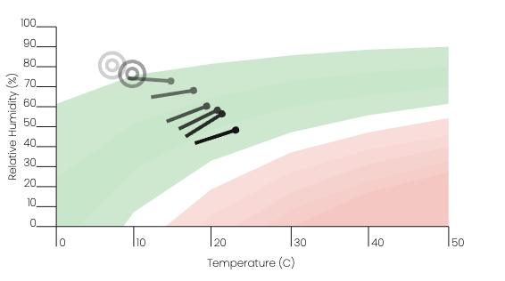
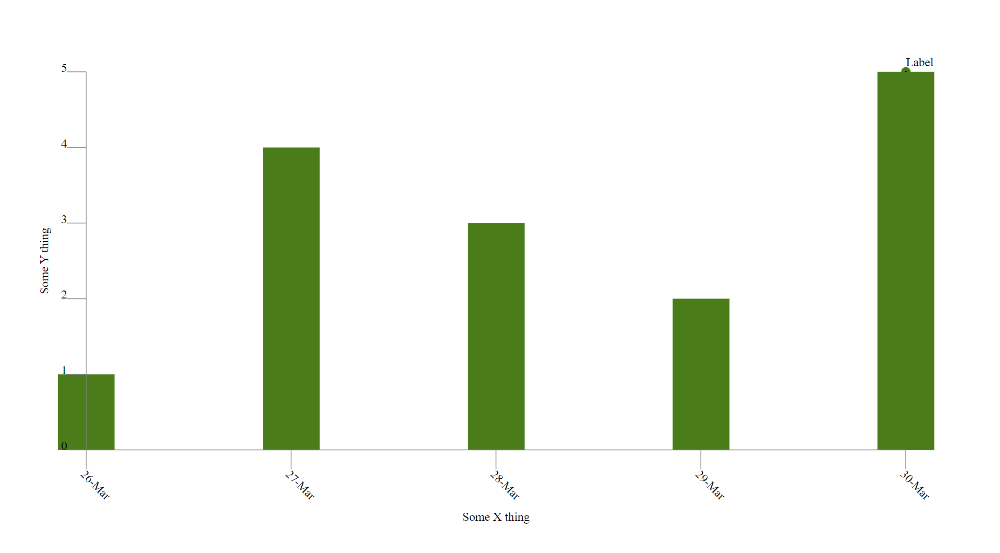
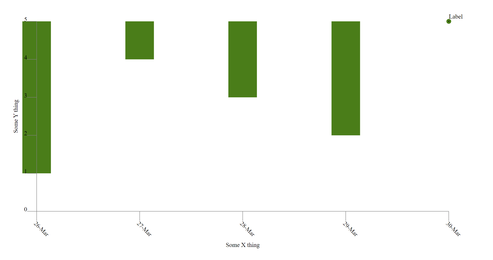
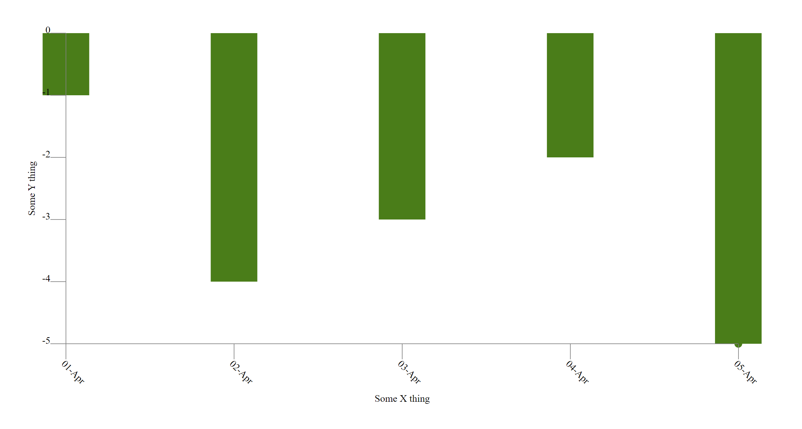

# Yew Charting Library

`yew-chart` is a collection of components that can be assembled to form charts
for the [Yew framework](https://github.com/yewstack/yew).

Here is a soil moisture/rainfall chart that has been produced using this library:

<p align="center"></p>

Here's another chart produced by this library, representing what is known as ["Delta-T"](http://www.bom.gov.au/lam/deltat.shtml):

<p align="center"></p>

By leveraging these SVG-based components many types of charts can be formed
with a great deal of flexibility. The library is intended as a toolkit that
provides conveniences for rendering chart primitives. These primitives can
be regarded at a similar level as SVG's primitives i.e. lines, polygons etc.

## Example Plots

Two basic projects are given in the `examples` folder.

### Line Chart

`examples/basic` is configured to output a basic line chart:

<p align="center"></p>

...and here's the entire Yew component that was used to generate it:

```rust
const WIDTH: f32 = 533.0;
const HEIGHT: f32 = 300.0;
const MARGIN: f32 = 50.0;
const TICK_LENGTH: f32 = 10.0;

#[function_component(App)]
fn app() -> Html {
    let end_date = Utc::now();
    let start_date = end_date.sub(Duration::days(4));
    let timespan = start_date..end_date;

    let circle_text_labeller = Rc::from(series::circle_text_label("Label"));

    let data_set = Rc::new(vec![
        (start_date.timestamp() as f32, 1.0, None),
        (
            start_date.add(Duration::days(1)).timestamp() as f32,
            4.0,
            None,
        ),
        (
            start_date.add(Duration::days(2)).timestamp() as f32,
            3.0,
            None,
        ),
        (
            start_date.add(Duration::days(3)).timestamp() as f32,
            2.0,
            None,
        ),
        (
            start_date.add(Duration::days(4)).timestamp() as f32,
            5.0,
            Some(circle_text_labeller),
        ),
    ]);

    let h_scale = Rc::new(TimeScale::new(timespan, Duration::days(1))) as Rc<dyn Scale>;
    let v_scale = Rc::new(LinearScale::new(0.0..5.0, 1.0)) as Rc<dyn Scale>;

    html! {
            <svg class="chart" viewBox={format!("0 0 {} {}", WIDTH, HEIGHT)} preserveAspectRatio="none">
                <Series
                    series_type={Type::Line}
                    name="some-series"
                    data={data_set}
                    horizontal_scale={Rc::clone(&h_scale)}
                    horizontal_scale_step={Duration::days(2).num_seconds() as f32}
                    vertical_scale={Rc::clone(&v_scale)}
                    x={MARGIN} y={MARGIN} width={WIDTH - (MARGIN * 2.0)} height={HEIGHT - (MARGIN * 2.0)} />

                <Axis
                    name="some-y-axis"
                    orientation={Orientation::Left}
                    scale={Rc::clone(&v_scale)}
                    x1={MARGIN} y1={MARGIN} xy2={HEIGHT - MARGIN}
                    tick_len={TICK_LENGTH}
                    title={"Some Y thing".to_string()} />

                <Axis
                    name="some-x-axis"
                    orientation={Orientation::Bottom}
                    scale={Rc::clone(&h_scale)}
                    x1={MARGIN} y1={HEIGHT - MARGIN} xy2={WIDTH - MARGIN}
                    tick_len={TICK_LENGTH}
                    title={"Some X thing".to_string()} />

            </svg>
    }
}
```

> If passing `SeriesData` around via `Props`, you'll need to provide a `PartialEq` implementation. Rust won't be able to derive one 
> automatically for you as `SeriesData` holds a closure that cannot be compared. This doesn't end up being a problem though as 
> should be performing an explicit pointer comparison when comparing `Rc` based values anyway; `Rc` contained references are immutable. 
> `Rc::ptr_eq` is your friend in this scenario.
>
> That all said, you probably won't be passing `SeriesData` around via props, but some other `Rc` of a model oriented data type
> which is to be mapped to it. Using `ptr_eq` is still the way to go there though as you'll get performance benefits.

### Bar Chart

Using the same Yew view method code as above, `series_type` within the `Series` tag can be edited to display a bar chart instead by using the `Bar` keys.

```rust
<Series series_type={Type::Bar(BarType::Rise)} ... />
```

<p align="center"></p>

The bar chart can also be made to 'drop' instead of 'rise' with the enum variant `BarType`. This is particularly helpful if using negative axis values, where the bars are dropping from `y = 0` or similar. 

When the `BarType` is set to `Drop`, the same data from above produces the following graph.

As seen, the bars are set to go from the selected side _to_ the datapoint. Since the axis range is from `0.0` to `5.0`, and the first point is at `(26-Mar, 1.0)`, the bar drops from `5.0` to `1.0`. 

```rust
<Series series_type={Type::Bar(BarType::Drop)} ... />
```

<p align="center"></p>

One final example of this is in using a negative scale and negative values. In the following graph, the axis ranges from `-5.0` to `0.0`, and the first point is `(01-Apr, -1.0)`.

<p align="center"></p>

### Scatter Plot

`examples/scatter` is configured to output a basic scatter plot. The method by which this is accomplished is slightly different to that of the `Line` and `Bar` charts. The labeller is relied upon for scatter plots.

## Contribution policy

Contributions via GitHub pull requests are gladly accepted from their original author. Along with any pull requests, please state that the contribution is your original work and that you license the work to the project under the project's open source license. Whether or not you state this explicitly, by submitting any copyrighted material via pull request, email, or other means you agree to license the material under the project's open source license and warrant that you have the legal authority to do so.

## License

This code is open source software licensed under the [Apache-2.0 license](./LICENSE).

© Copyright [Titan Class P/L](https://www.titanclass.com.au/), 2021
